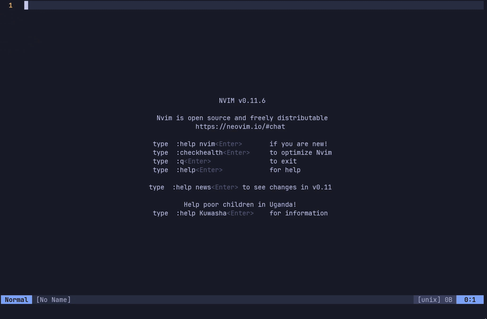

# tf-docs.nvim

Terraform provider documentation *inside* nvim - simple & fast

## ✨ Features
1. Lazy install, update, and removal of provider docs
2. Search terraform provider docs inside nvim
3. Extensible provider layout & custom providers
4. Multi-picker options (`telescope.nvim`, `snacks`, `fzf-lua`, or BYO)
5. Configurable docs display


| Browse with picker | Search specific resouce |
| :---: | :---: |
|  |  |
## ⚡️ Requirements
- `nvim`
- `git`
- nvim file picker (`snacks`, `telescope`, `fzf-lua`)

## 📦 Installation
`lazy.nvim` minimal install with defaults
```lua
return {
  'cablecreek/tf-docs.nvim',
  dependencies = {
    'folke/snacks.nvim', -- snacks is the default picker

    -- optional - renders md view 
    -- 'MeanderingProgrammer/render-markdown.nvim',

  },
  opts = {
    providers = {
      -- add named providers here
      -- 'aws', 'google', 'kubernetes',
      --
      -- or add a custom provider
    },
  },
}
```

## 🚀 Usage
```lua
TFDocs <provider> -- opens picker and browsing docs
TFDocsSearch <provider> <type> <resource> -- opens doc in view
```

## ⚙️ Configuration/Options 
`tf-docs` comes with defaults however, the following can be customised
1. providers 
2. docs window  
3. picker 

### 📋 0. default options
```lua
opts = {
  providers = {},
  picker = "snacks", -- "telescope", "fzf", "snacks", or BYO <function>
  provider_docs_install_location = vim.fn.stdpath("data") .. "/tf-docs", -- ~/.local/share/nvim/
  win_config = {
    -- either a `split` or `float`
    split = "right", -- "right"|"left"|"above"|"below" The direction to split the current window.
    float = nil, -- is a `vim.api.keyset.win_config` type i.e. width, height, border, etc. 
  },
}
```

### 🔌 1. providers
- take a look at the `/providers/` structure
- as a rule of thumb for the provider config
  - it is legacy if the repo contains `website/docs/`
  - legacy also tends to use `.html.markdown`
  - `aws` and `gcp` are examples of legacy, `k8s` is current
```lua
opts = {
  providers = {
    -- current doc structure
    {
      name = 'my_k8s', -- becomes the dir name and registry key, i.e. :TFDocs my_k8s
      repo_url = "https://github.com/hashicorp/terraform-provider-kubernetes.git",
      search_title = "Terraform Kubernetes Docs",
      file_extension = ".md",
    },

    -- legacy structure
    {
      name = 'my_aws', -- becomes the dir name and registry key, i.e. :TFDocs my_aws
      repo_url = "https://github.com/hashicorp/terraform-provider-aws.git",
      is_legacy_docs = true,
      search_title = "Terraform AWS Docs",
      file_extension = ".html.markdown",
    },
  },
}
```

### 📜 2. docs window
```lua
-- split below
opts = {
  win_config = {
    split = "below",
  },
}

```

```lua
-- floating window
opts = {
  win_config = {
    float = {
      relative = "editor",
      width = math.floor(vim.o.columns * 0.7),
      height = math.floor(vim.o.lines * 0.7),
      row = math.floor((vim.o.lines - (vim.o.lines * 0.7)) / 2),
      col = math.floor((vim.o.columns - (vim.o.columns * 0.7)) / 2),
      border = "rounded",
    },
  },
}

-- etc. 
```

### 🔍 3. picker
There are 2 functions that allow you to create a custom picker
1. `get_doc_table` - returns a table with document items
2. `open` - opens the selected file in the view 

Example of a minimal `snacks` picker:
```lua
local custom_snacks_picker = function(provider)
  -- ensure you load the plugin inside the function
  local tf_docs = require 'tf-docs'

  require('snacks').picker.pick {
    source = 'Terraform Docs',
    -- Accessing the exposed doc table function
    items = tf_docs.get_doc_table(provider),
    preview = 'file',
    format = function(item)
      return {
        { item.emoji, 'SnacksPickerEmoji' },
        { ' ' .. (item.name or ''), 'SnacksPickerLabel' },
      }
    end,
    confirm = function(picker, item)
      picker:close()
      if item then
        -- Accessing the exposed view function
        tf_docs.open(item.file)
      end
    end,
  }
end
```

and then assign the picker
```lua
opts = {
  providers = {},
  picker = custom_snacks_picker, -- assign your picker  
}

``` 

## 🛠️ Supported Official Providers
Currently, `tf-docs.nvim` supports the following providers

| Provider | Terraform Registry | Repository | Tier |
|---|---|---|---|
| aws | [aws](https://registry.terraform.io/providers/hashicorp/aws) | [aws](https://github.com/hashicorp/terraform-provider-aws) | Official |
| azurerm | [azurerm](https://registry.terraform.io/providers/hashicorp/azurerm) | [azurerm](https://github.com/hashicorp/terraform-provider-azurerm) | Official |
| google | [google](https://registry.terraform.io/providers/hashicorp/google) | [google](https://github.com/hashicorp/terraform-provider-google) | Official |
| kubernetes | [kubernetes](https://registry.terraform.io/providers/hashicorp/kubernetes) | [kubernetes](https://github.com/hashicorp/terraform-provider-kubernetes) | Official |
| aap | [aap](https://registry.terraform.io/providers/ansible/aap) | [aap](https://github.com/ansible/terraform-provider-aap) | Official |
| ad | [ad](https://registry.terraform.io/providers/hashicorp/ad) | [ad](https://github.com/hashicorp/terraform-provider-ad) | Official |
| archive | [archive](https://registry.terraform.io/providers/hashicorp/archive) | [archive](https://github.com/hashicorp/terraform-provider-archive) | Official |
| awscc | [awscc](https://registry.terraform.io/providers/hashicorp/awscc) | [awscc](https://github.com/hashicorp/terraform-provider-awscc) | Official |
| azuread | [azuread](https://registry.terraform.io/providers/hashicorp/azuread) | [azuread](https://github.com/hashicorp/terraform-provider-azuread) | Official |
| azurestack | [azurestack](https://registry.terraform.io/providers/hashicorp/azurestack) | [azurestack](https://github.com/hashicorp/terraform-provider-azurestack) | Official |
| boundary | [boundary](https://registry.terraform.io/providers/hashicorp/boundary) | [boundary](https://github.com/hashicorp/terraform-provider-boundary) | Official |
| cloudinit | [cloudinit](https://registry.terraform.io/providers/hashicorp/cloudinit) | [cloudinit](https://github.com/hashicorp/terraform-provider-cloudinit) | Official |
| consul | [consul](https://registry.terraform.io/providers/hashicorp/consul) | [consul](https://github.com/hashicorp/terraform-provider-consul) | Official |
| dns | [dns](https://registry.terraform.io/providers/hashicorp/dns) | [dns](https://github.com/hashicorp/terraform-provider-dns) | Official |
| external | [external](https://registry.terraform.io/providers/hashicorp/external) | [external](https://github.com/hashicorp/terraform-provider-external) | Official |
| google-beta | [google-beta](https://registry.terraform.io/providers/hashicorp/google-beta) | [google-beta](https://github.com/hashicorp/terraform-provider-google-beta) | Official |
| helm | [helm](https://registry.terraform.io/providers/hashicorp/helm) | [helm](https://github.com/hashicorp/terraform-provider-helm) | Official |
| hcs | [hcs](https://registry.terraform.io/providers/hashicorp/hcs) | [hcs](https://github.com/hashicorp/terraform-provider-hcs) | Official |
| hcp | [hcp](https://registry.terraform.io/providers/hashicorp/hcp) | [hcp](https://github.com/hashicorp/terraform-provider-hcp) | Official |
| http | [http](https://registry.terraform.io/providers/hashicorp/http) | [http](https://github.com/hashicorp/terraform-provider-http) | Official |
| ibm | [ibm](https://registry.terraform.io/providers/IBM-Cloud/ibm) | [ibm](https://github.com/IBM-Cloud/terraform-provider-ibm) | Official |
| instana | [instana](https://registry.terraform.io/providers/instana/instana) | [instana](https://github.com/instana/terraform-provider-instana) | Official |
| local | [local](https://registry.terraform.io/providers/hashicorp/local) | [local](https://github.com/hashicorp/terraform-provider-local) | Official |
| nomad | [nomad](https://registry.terraform.io/providers/hashicorp/nomad) | [nomad](https://github.com/hashicorp/terraform-provider-nomad) | Official |
| null | [null](https://registry.terraform.io/providers/hashicorp/null) | [null](https://github.com/hashicorp/terraform-provider-null) | Official |
| ode | [ode](https://registry.terraform.io/providers/IBM/ode) | [ode](https://github.com/IBM/terraform-provider-ode) | Official |
| random | [random](https://registry.terraform.io/providers/hashicorp/random) | [random](https://github.com/hashicorp/terraform-provider-random) | Official |
| template | [template](https://registry.terraform.io/providers/hashicorp/template) | [template](https://github.com/hashicorp/terraform-provider-template) | Official |
| tfe | [tfe](https://registry.terraform.io/providers/hashicorp/tfe) | [tfe](https://github.com/hashicorp/terraform-provider-tfe) | Official |
| tfmigrate | [tfmigrate](https://registry.terraform.io/providers/hashicorp/tfmigrate) | [tfmigrate](https://github.com/hashicorp/terraform-provider-tfmigrate) | Official |
| time | [time](https://registry.terraform.io/providers/hashicorp/time) | [time](https://github.com/hashicorp/terraform-provider-time) | Official |
| tls | [tls](https://registry.terraform.io/providers/hashicorp/tls) | [tls](https://github.com/hashicorp/terraform-provider-tls) | Official |
| turbonomic | [turbonomic](https://registry.terraform.io/providers/IBM/turbonomic) | [turbonomic](https://github.com/IBM/terraform-provider-turbonomic) | Official |
| vault | [vault](https://registry.terraform.io/providers/hashicorp/vault) | [vault](https://github.com/hashicorp/terraform-provider-vault) | Official |
| vault | [vault](https://registry.terraform.io/providers/hashicorp/vault) | [vault](https://github.com/hashicorp/terraform-provider-vault) | Official |
| oci | [oci](https://registry.terraform.io/providers/oracle/oci) | [oci](https://github.com/oracle/terraform-provider-oci) | Partner |
| alicloud | [alicloud](https://registry.terraform.io/providers/aliyun/alicloud) | [alicloud](https://github.com/aliyun/terraform-provider-alicloud) | Partner |


